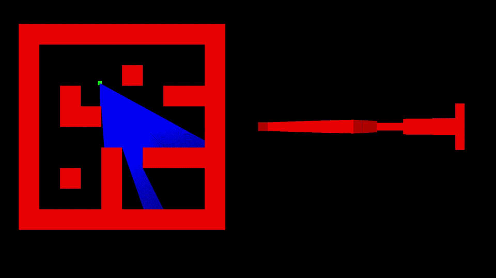
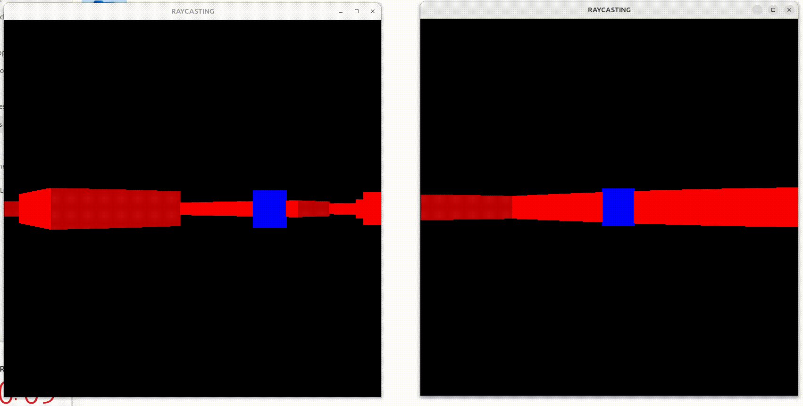

# Raycasting 2D space to 3D

**2.5D** raycasting-based game engine built in C++ (with SFML) that simulates a 3D environment using efficient 2D rendering techniques — inspired by early classics like Wolfenstein 3D.

## Features:

* Real-time raycasting renderer for walls, objects.

* Multiplayer networking via shared memory to python networking modules with multiple streams for communication via multithreading.

## Following video demonstrates how raycasting logic works:

* There are 400 rays casted in a range of 60* FOV , each ray fills 2 pixels of horizontal area on a resolution of 800 pixel window.



## Struture of Interprocess Communication:

```
                        ┌────────────────────────────┐
                        │     Python Client (Net)    │
                        │────────────────────────────│
                        │  1. Connect to server      │
                        │  2. Receive other players  │
                        │  3. Write to RECV shm      │
                        │  4. Read from SEND shm     │
                        └───────────┬────────────────┘
                                    │
                         RECV shm   │   SEND shm
                   (game reads  )   │   (game writes  )
                                    │
                        ┌───────────┴────────────────┐
                        │   C++ Raycasting Engine    │
                        │────────────────────────────│
                        │  1. Read RECV shm updates  │
                        │  2. Update game state      │
                        │  3. Render scene (SFML)    │
                        │  4. Write player state     │
                        │     to SEND shm            │
                        └────────────────────────────┘
```
## Demo of two clients POV
(couldn't control both at a time on same window):



## Build and running the code:

### Build:

```
mkdir build
cd build
cmake ..
cmake --build .
cd ..
```

### Run python server:

```
python3 Network/server.py
```

### Run the clients:

* Shared memory names to be specified explicitly (to avoid conflits while testing multiplayer, will be fixed).

```
./run_pair.sh <shm_name1> <shm_name2>
```

### Future improvements and Fixes:

* Change the main entry point to somewhere clean.
* Add textures and sprites.
* Improve game logic similar to an Fpp game interaction
* Make the launching of the game easier.
